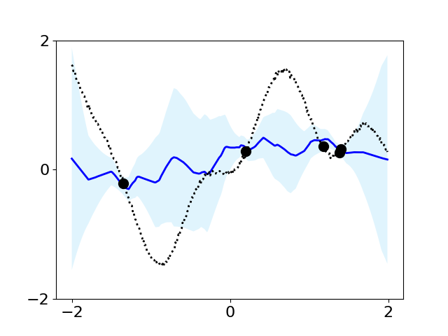
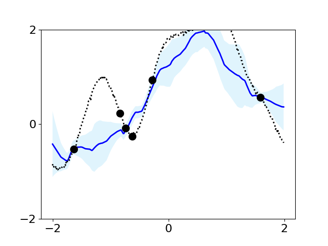
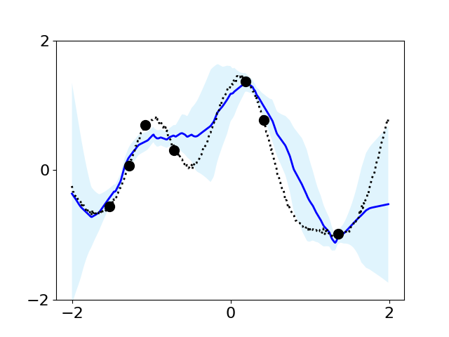
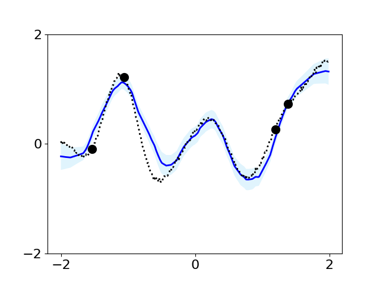
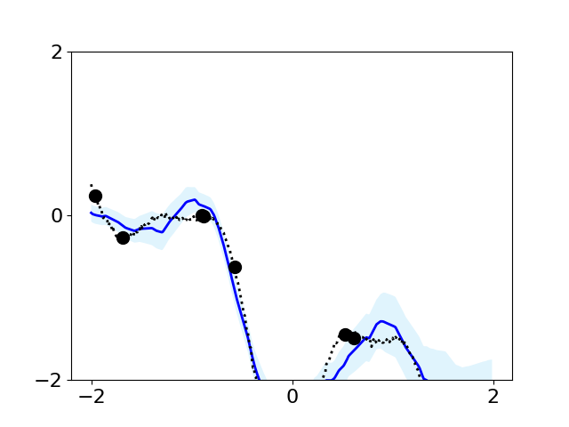
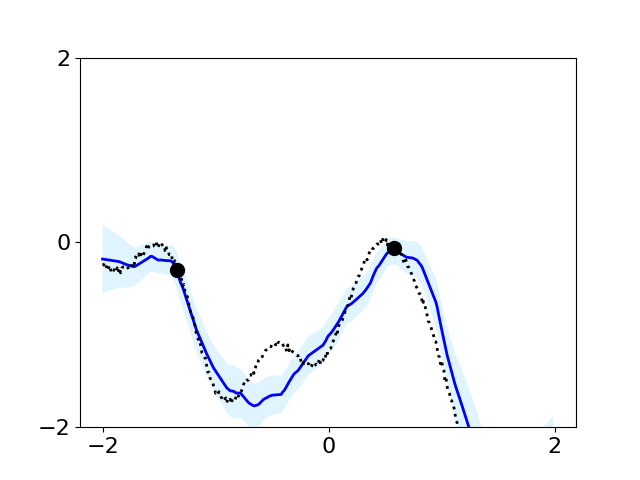
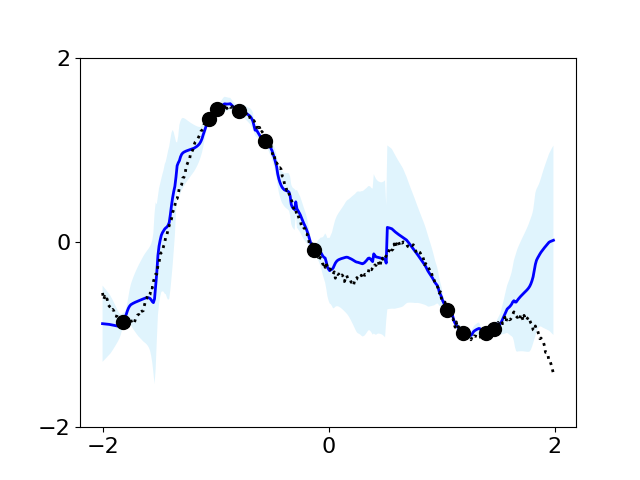
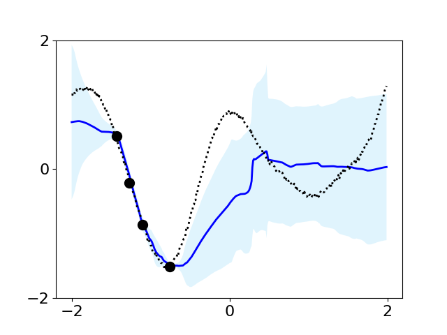
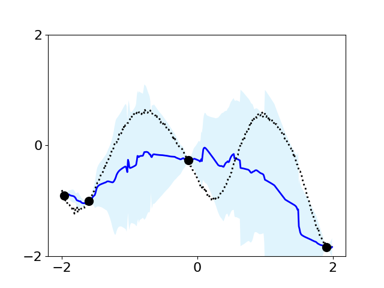

# Few-Shot Learning vs In-Context Learning: any difference?

## Table of Contents
- [Neural Processes](#neural-processes)
- [Features](#features)
- [Installation](#installation)
- [Usage](#usage)
  - [Training](#training)
  - [Inference](#inference)
- [Examples](#examples)
- [References](#references)

## Neural Processes

Deep learning excels in data-driven predictions but struggles in small data settings where reliable uncertainty estimation is critical, such as predicting patient treatment outcomes where individual data are limited. Traditional deep neural networks often lack the ability to quantify their uncertainty, risking confident but incorrect predictions. The **Neural Process Family (NPF)** is a collection of models that addresses these challenges by *meta-learning* a distribution over predictors through neural processes. This approach leverages data from multiple related tasks to effectively model uncertainty using a stochastic process framework. Consequently, NPFs provide more accurate and reliable predictions in scenarios with limited data and high uncertainty requirements.

## Examples on 1D Toy Regression Dataset

### CNP
  

- Suffers from underfitting.
- Often does not pass through all context points.
- Overestimates uncertainty.

### LNP 
  

- Produces coherent sampling from the posterior predictive.
- Same underfitting issues as CNP
- Beyond [-1,1], model seems to disregard context points and uncertainty despite being trained in the range [-2,2].

### AttnCNP
  

- Still demonstrated underfitting issues.
- 'Kinks' in predictive distribution.

## References
- [1]. Dubois Y, Gordon J, Foong AYK. Neural Process Family. September 2020. Available from: http://yanndubs.github.io/Neural-Process-Family/  
- [2]. Tuan Anh Le, Hyunjik Kim, Marta Garnelo, Dan Rosenbaum, Jonathan Schwarz, and Yee Whye Teh. Empirical evaluation of neural process objectives. In NeurIPS workshop on Bayesian Deep Learning. 2018.  
- [3]. Garnelo M, Rosenbaum D, Maddison CJ, Ramalho T, Saxton D, Shanahan M, Teh YW, Rezende DJ, Eslami SMA. Conditional Neural Processes. CoRR. 2018;abs/1807.01613. Available from: http://arxiv.org/abs/1807.01613.  
- [4]. Marta Garnelo, Jonathan Schwarz, Dan Rosenbaum, Fabio Viola, Danilo J. Rezende, S. M. Ali Eslami, and Yee Whye Teh. Neural processes. CoRR, 2018. URL: http://arxiv.org/abs/1807.01622, arXiv:1807.01622.  
- [5]. Kim H, Mnih A, Schwarz J, Garnelo M, Eslami SMA, Rosenbaum D, Vinyals O, Teh YW. Attentive Neural Processes. CoRR. 2019;abs/1901.05761. Available from: http://arxiv.org/abs/1901.05761.  

